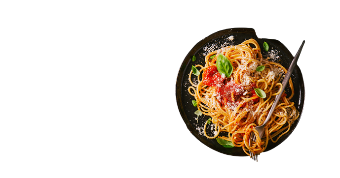

<!-- TABLE OF CONTENTS -->
<details>
  <summary>Table of Contents</summary>
  <ol>
    <li>
      <a href="#about-the-project">About The Project</a>
      <ul>
        <li><a href="#built-with">Built With</a></li>
      </ul>
    </li>
    <li>
      <a href="#getting-started">Getting Started</a>
      <ul>
        <li><a href="#prerequisites">Prerequisites</a></li>
        <li><a href="#installation">Installation</a></li>
        <li><a href="#Demo">Demo</a></li>
        <li><a href="#Future-implementations ">Installation</a></li>
        <li><a href="#Demo">Demo</a></li>
        <li><a href="# Contribution"> Contribution</a></li>
        <li><a href="#installation">Installation</a></li>
        <li><a href="# contributors">Contributors</a></li>

        
   </ul>
    </li>
<ul>
    <li><a href="#license">License</a></li>
    <li><a href="#contact">Contact</a></li>
    <li><a href="#acknowledgments">Contributors</a></li></ul>
  </ol>
</details>


<!-- ABOUT THE PROJECT -->
## About The Project
This is a front-end implementation of a restaurant website. It is a complete front-end site with four pages: The landing page, the login page, a menu page and reservations page. <br>
Each page's UI and code was carried out by an individual group member.<br>
The significance of this project is:
<ol>
<li>It gives the restaurant a digital brand image, which is important in this digital age</li>
<li> Increase market reach by appealing to the new customer frontier, which is the internet 
</li>
<li>Create customer trust, by giving the customer first-hand information regarding the restaurant rather than relying on third-party websites for information. Things like menu updates, chef specials wil especially benefit from this</li>
<li>Having a digital footprint is as important a marketing frontier as mainstream media, if not more. Moreover maintaining a website is much cheaper than running advertisement on mainstream media. You can also use google ads to increase your reach.
</li>
<li>A website also provides a platform to provide other services such as reservations, events and other services that can attract users and increase revenue growth.</li>
</ol>

### Built With

Several technologies have been used in the design and implementation of this website.
The technologies are:
<ol>
<li>HTML5</li>
<li>CSS3</li>
<li>Vannila JavaScript</li>
<li>Figma</li>
<li>Fontawesome icons</li>
<li>Google fonts ("Cormorant Upright")</li></ol>

<p align="right">(<a href="#top">back to top</a>)</p>


<!-- GETTING STARTED -->
## Getting Started

These are the steps required to use this project:

### Prerequisites

NodeJS
* npm
  ```sh
  npm install npm@latest -g
  ```
  On windows PowerShell
  ```
  nvm install latest
  ```
  HTML and CSS require no installations as they can run on the web browser

### Installation

1. Clone the repo
   git clone [git@github.com:SheeTabz/DigiHoteL.git](https://github.com/SheeTabz/DigiHoteL.git)

<p align="right">(<a href="#top">back to top</a>)</p>


<p align="right">(<a href="#top">back to top</a>)</p>

## Demo
Use the link provided to navigate to the DigiHotel website.
[DigiHoteL](https://github.com/SheeTabz/DigiHoteL/)<br>

The page appears as shown below and has the following features:
- This is the landingpage: It a descriptive section that tells you what the website is all about. The home,menu,about,reservations buttons and the login link will help you navigate through the pages.


This is the Login page:It is an entry page to a website that requires user identification and authentication, regularly performed by entering a username and password combination. Logins may provide access to the homepage part of the DigiHoteL website. Logging in not only provides site access for the user, but also allows the website to track user actions and behavior.


- Other pages: This is the Menu page that has a list of dishes that are available for sale in a food service outlet or that can be served at a meal. <br>


- This is how the About Us section will look like.


-This is the reservations page:The purpose of the hotel reservation page is to allow visitors to book their meals online using the website. It enables a more seamless booking procedure and conveniently collects information into our database.


## Future-implementations 
- JavaScript
- Search APIs
  
  ## Contribution
If you need to contribute to this project follow the steps below:<br>
- Clone the repo(`git clone <repo link>`)
- Create a branch where you will add changes (`git branch -b <branchname>`)
- Add the changes (`git add .`)
- Commit changes (`git commit -m"contributing changes"`)
- Push your changes (`git push origin <branchname>`)
  
## Code Samples
```Html
<body>
    <!-- NAVIGATION BAR -->
    <nav>
        <label for="" class="logo"><a href="">DigiHotel</a></label>
        <ul class="nav-link">
            <li><a href="">Home</a></li>
            <li><a href="#about">About</a></li>
            <li><a href="./assets/html/main_menu.html">Menu</a></li>
            <li><a href="./assets/html/reservations.html">Reservations</a></li>
        </ul>
        <button class="login"><a href="./assets/html/login.html">Log In</a></button>
    </nav>

    <!-- HOME SECTION -->
    <div class="hero">
        <div class="heroSec">
            <div class="content">
                <h1>The flavors of life are just a bite away</h1>
                <p>We ought to be about something beyond moving chicken. We ought to be a piece of our client’s lives
                    and the networks in which we serve.</p>
                <button>Explore</button>
            </div>
            <div class="image">
                
            </div>
        </div>
    </div>
  ```
      <!-- CSS PART OF THE ABOVE SECTIONS -->
```css
    nav{
    /* background-color: blue; */
    width: 85%;
    margin: auto;
    display: flex;
    justify-content: space-between;
    align-items: center;
    height: 10vh;

}
nav>ul{
    /* background-color: aquamarine; */
    display: flex;
    list-style: none;

}
a{
    text-decoration: none;
    color: inherit;

}
nav>ul>li{
   margin-right: 60px;
   font-size: 1.2rem;
   font-weight: 600;
}
label{
    color: #ed5625;
    font-size: 2rem;
    font-weight: 800;
}
nav>button{
    background-color: #ed5625;
    color: white;
    padding: 10px;
    width: 100px;
    font-size: 1.3rem;
   font-weight: 600;
   border: none;
   border-radius: 10px;
}

/* HOME SECTION */
.hero{
    background-image: url("/bg.png");
    /* background-color: black; */
    color: #FFFF;
    height: 70vh;
    width: 100%;

}
.heroSec{
    display: flex;
    flex-direction: row;
    align-items:center;
   
    justify-content: space-between;
    width: 85%;
    margin: auto;
    
}

.content{
    /* background-color: red; */
    width: 100%;
    max-width: 800px;
    min-width: 500px;
    margin-right: 40px;
    margin-top: 60px;
}
.content h1, .about h2{
    font-family: 'Cormorant Upright', sans-serif;

}
```

<!-- LICENSE -->
## License
### MIT License

Distributed under the MIT License. See `LICENSE.txt` for more information.
[](https://opensource.org/licenses/MIT)  
`[](https://opensource.org/licenses/MIT)`

<p align="right">(<a href="#top">back to top</a>)</p>


<!-- CONTACT -->
## Contact
(https://github.com/salvatoluice)
(https://github.com/SheeTabz)
(https://github.com/Kangonga)
(https://github.com/Rhoda-Gachimu)

Project Link: [https://github.com/SheeTabz/DigiHoteL]

<p align="right">(<a href="#top">back to top</a>)</p>


<!-- ACKNOWLEDGMENTS -->
## contributors
<ol>
<li>Salvato Luis = Team lead</li>      (https://github.com/salvatoluice)
<li>Tabitha Muriithi = Team member</li>(https://github.com/SheeTabz)
<li>Kevin Guchu = Team member</li>     (https://github.com/Kangonga)
<li>Rhoda Gachimu = Team member</li>   (https://github.com/Rhoda-Gachimu)
</ol>

<p align="right">(<a href="#top">back to top</a>)</p>


<!-- MARKDOWN LINKS & IMAGES -->
<!-- https://www.markdownguide.org/basic-syntax/#reference-style-links -->
[contributors-shield]: https://img.shields.io/github/contributors/othneildrew/Best-README-Template.svg?style=for-the-badge
[contributors-url]: https://github.com/othneildrew/Best-README-Template/graphs/contributors
[forks-shield]: https://img.shields.io/github/forks/othneildrew/Best-README-Template.svg?style=for-the-badge
[forks-url]: https://github.com/othneildrew/Best-README-Template/network/members
[stars-shield]: https://img.shields.io/github/stars/othneildrew/Best-README-Template.svg?style=for-the-badge
[stars-url]: https://github.com/othneildrew/Best-README-Template/stargazers
[issues-shield]: https://img.shields.io/github/issues/othneildrew/Best-README-Template.svg?style=for-the-badge
[issues-url]: https://github.com/othneildrew/Best-README-Template/issues
[license-shield]: https://img.shields.io/github/license/othneildrew/Best-README-Template.svg?style=for-the-badge
[license-url]: https://github.com/othneildrew/Best-README-Template/blob/master/LICENSE.txt
[linkedin-shield]: https://img.shields.io/badge/-LinkedIn-black.svg?style=for-the-badge&logo=linkedin&colorB=555
[linkedin-url]: https://linkedin.com/in/othneildrew
[product-screenshot]: images/screenshot.png
[Next.js]: https://img.shields.io/badge/next.js-000000?style=for-the-badge&logo=nextdotjs&logoColor=white
[Next-url]: https://nextjs.org/
[React.js]: https://img.shields.io/badge/React-20232A?style=for-the-badge&logo=react&logoColor=61DAFB
[React-url]: https://reactjs.org/
[Vue.js]: https://img.shields.io/badge/Vue.js-35495E?style=for-the-badge&logo=vuedotjs&logoColor=4FC08D
[Vue-url]: https://vuejs.org/
[Angular.io]: https://img.shields.io/badge/Angular-DD0031?style=for-the-badge&logo=angular&logoColor=white
[Angular-url]: https://angular.io/
[Svelte.dev]: https://img.shields.io/badge/Svelte-4A4A55?style=for-the-badge&logo=svelte&logoColor=FF3E00
[Svelte-url]: https://svelte.dev/
[Laravel.com]: https://img.shields.io/badge/Laravel-FF2D20?style=for-the-badge&logo=laravel&logoColor=white
[Laravel-url]: https://laravel.com
[Bootstrap.com]: https://img.shields.io/badge/Bootstrap-563D7C?style=for-the-badge&logo=bootstrap&logoColor=white
[Bootstrap-url]: https://getbootstrap.com
[JQuery.com]: https://img.shields.io/badge/jQuery-0769AD?style=for-the-badge&logo=jquery&logoColor=white
[JQuery-url]: https://jquery.com 
